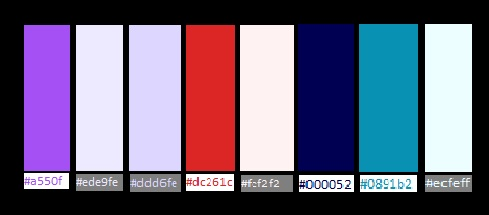

# Welcome to VectorizeIt client !!!

## Programming lenguages, frameworks and libraries
- JavaScript
- Express.js
- React.js
- Axios
- Tailwind.css

## Color palette

## Link to deploy
[VectorizeIt website] (https://vectorizeit.adaptable.app)

Description | Type | Route | File-name
------------- | ------------- | ------------- | -------------
Display main | Page | / | /HomePage.jsx
Display login | Page | /login | /HomePage.jsx
Display sign-up | Page | /signup | /SignupPage.jsx
Display one game | Page | /game/:idGame | /GamePage.jsx
Display user info | Page | /user/:idUser | /ProfilePage.jsx
Display played games | Page | /game/:idUser/played-games | /PlayedGamesPage.jsx
Display created games | Page | /game/:idUser/created-games | /CreatedGamesPage.jsx
Display every review form a game | Page | /review/:idGame/all | /ReviewsPage.jsx
Display a form to add a review | Component | < AddReview /> | /AddReview.jsx
Display a form  to modify a review | Component | < ModifyReview /> | /ModifyReview.jsx
Display a button to delete a review | Component | < DeleteReview /> | /DeleteReview.jsx
Display a button to add game as played | Component | < AddPlayedGame /> | /AddPlayedGame.jsx
Display a button to remove game from played | Component | < RemovePlayedGame /> | /RemovePlayedGame.jsx
Display a form to create a game for the DB | Component | < CreateGame /> | /CreateGame.jsx
Display a form to modify the data of a game | Component | < ModifyGame /> | /ModifyGame.jsx
Display a button to delete game from the DB | Component | < DeleteGame /> | /DeleteGame.jsx
Display a form to update your profile | Component | < UpdateProfile /> | /UpdateProfile.jsx
Display a form as a search bar to find videogames at the home page | Component | < SearchBar /> | /SearchBar.jsx